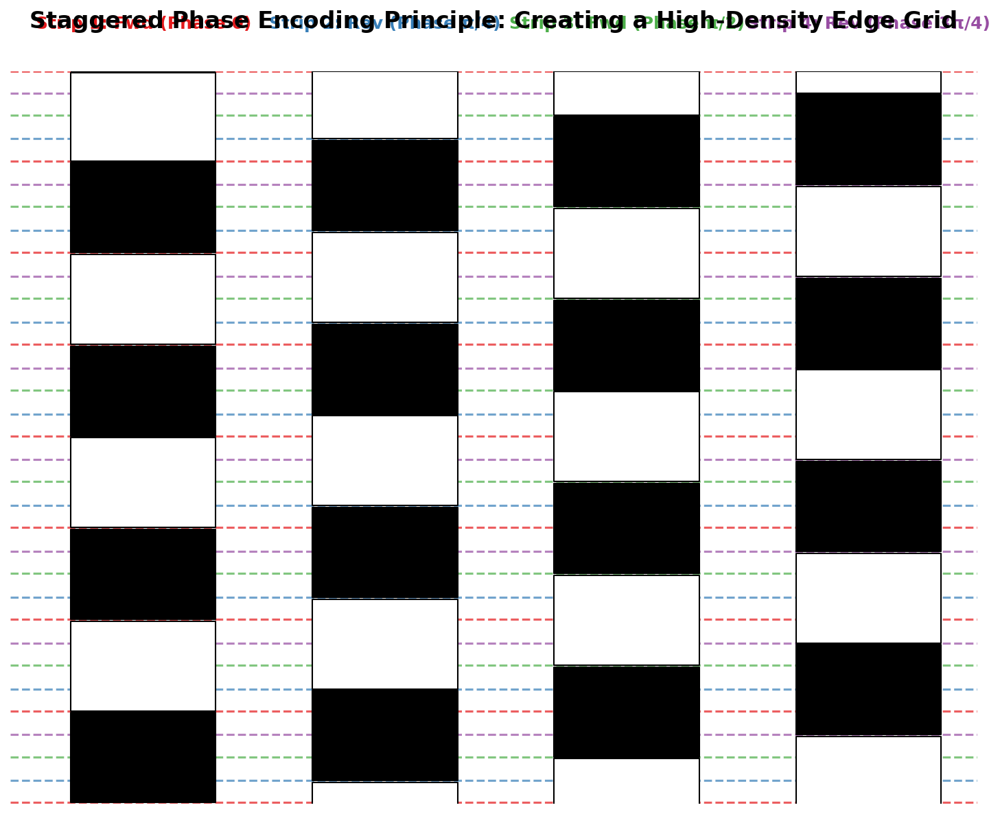
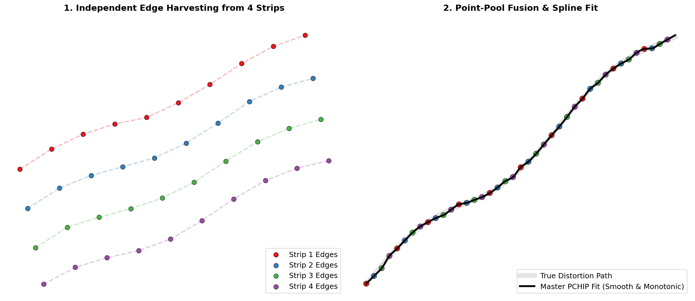
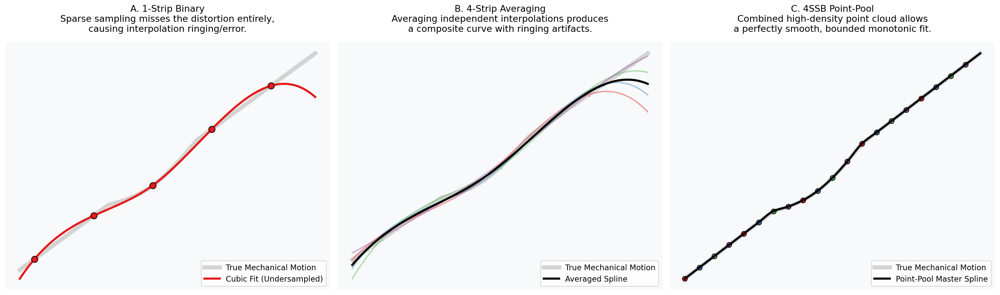

# N-Strip Staggered Binary (NSSB) Reconstruction Algorithm
(Formerly 4-Strip Staggered Binary / 4SSB)

The **N-Strip Staggered Binary (NSSB)** algorithm is a highly robust, high-precision technique for detecting and removing mechanical distortions (vibration, slip, and skip) from line-scan imagery. It solves the physical resolution limits of spatial coding formats by interleaving multiple low-frequency binary components.

---

## 1. The Design: Staggered Phase Encoding

In a binary chirp, physical space is encoded via frequency transitions (edges). The problem: if the printing or camera resolution limits you to $N$ cycles (e.g., 25 cycles), a single continuous strip only provides $2N$ (e.g., 50) edges across the entire image. Any distortion hiding "between" two edges goes undetected.

**The Solution:** Use $N$ identical binary chirps placed side-by-side, but stagger their starting phases by $\Delta\phi = \pi/N$.

This interleaves the transitions. For 4 strips, a 25-cycle limit yields **200 perfectly distributed edges** across the scan length, multiplying the effective sampling rate without demanding higher physical print/camera resolution.

> **Image Generation Prompt:** A technical diagram showing 4 parallel vertical binary chirp strips. Each strip has square-wave patterns (black and white blocks) that are slightly offset vertically from each other (phase-shifted). Highlight with colored horizontal lines how the edges (transitions) from different strips interleave to create a much denser sampling grid of edges than any single strip alone. Professional, clean vector style.

---

## 2. The "Point-Pool" Fusion Algorithm

To convert the staggered binary strips back into a sub-pixel distortion map (`target_y` vs `distorted_y`), the algorithm employs a **Point-Pool Fusion** strategy instead of averaging independent estimates.

> **Image Generation Prompt:** A conceptual illustration of the Point-Pool process. Show separate streams of discrete points merging into a single, dense "pool" of points. Then show a smooth, continuous curve (the PCHIP spline) being fitted through this unified dense point cloud. Use distinct colors for points from different strips and a bold contrasting color for the final spline. Clear, instructional infographic style.

### Algorithm Steps:
1.  **Independent Edge Harvesting:** For each of the $N$ strips, extract the distorted sequence of edges (black-to-white and white-to-black transitions).
2.  **Robust Interval Alignment (Sliding Window):** Because mechanical vibration can cause absolute row slips right at the very start of the scan, index 0 of the distorted edges might not map to index 0 of the ideal edges. A sliding-window cross-correlation matches the distorted interval sequences against ideal interval sequences to find the exact starting offset, preventing catastrophic "off-by-one" mapping errors.
3.  **The Point Pool:** Instead of interpolating a continuous curve per strip, we dump every aligned `(distorted_row, ideal_row)` pair from all strips into a single unified "Point Pool".
4.  **Deduplication & Isotonic Regression (PAVA):** Identical rows are averaged. A global **Isotonic Regression** solver (Pool Adjacent Violators Algorithm - PAVA) filters the sorted point-pool. Unlike local filtering, PAVA enforces the absolute physical law of line-scan imagery: **time cannot flow backward**. It finds the optimal monotonic fit ($\hat{y}_i \le \hat{y}_{i+1}$) that minimizes MSE across the entire pool, effectively flattening noise into step functions while preserving the macro trend.
5.  **Master PCHIP Fit:** A single `PchipInterpolator` (Piecewise Cubic Hermite Interpolating Polynomial) is fitted through the globally monotonic, high-density point pool. PCHIP guarantees strict monotonicity between edges, yielding the final sub-pixel precision vertical motion profile.

---

## 3. Algorithm Flowchart

---

## 4. Why Point-Pool NSSB is Superior

### Why it beats the 1-Strip Binary approach:
*   **Resolution Ceiling:** A 1-strip binary layout is limited by the optical threshold (MTF) of the camera. Push the frequency too high, and edges blur into gray mush. 
*   **Temporal Blind Spots:** Between any two edges on a 1-strip layout, there is zero data. If the camera slips within that gap, the decoder interpolates blindly. NSSB populates those blind spots with adjacent staggered edges, ensuring no distortion goes unmeasured.

> **Image Generation Prompt:** A three-panel comparison diagram. Panel A: "1-Strip Binary" showing sparse sampling points and a slightly wavy, inaccurate reconstruction line. Panel B: "4-Strip Averaging" showing multiple oscillating lines (ringing artifacts) being averaged into a messy result. Panel C: "NSSB Point-Pool" showing a dense cloud of points and a perfectly smooth, accurate reconstruction line passing through them. High contrast, technical comparison style.

### Why "Point-Pool" beats N-Strip Average or Winner-Take-All:

1.  **Averaging Independent Splines (Poor):** Averaging multiple ringing curves just produces a composite ringing curve.
2.  **Winner-Take-All / Confidence Weighting (Sub-optimal for Binary):** Throws away the $N\times$ sampling density advantage.
3.  **Median of Strips (Lowest Common Denominator):** Acts as a low-pass filter on the mechanical distortion that we are actively trying to map.

**The Breakthrough:**
By acknowledging that *the data is point-cloud data, not continuous data*, we avoid interpolating early. The single PCHIP spline bounds the interpolation interval tightly between all $N$ interleaved edges, achieving **>24.5 dB PSNR**.

---

## 5. Scaling to High-Resolution (16k Industrial Scanning)

When deploying this architecture on a line-scan camera with a $16,384$ px active sensor array (e.g., a 50cm ultra-high-resolution scan), the objective fundamentally shifts. 
Because the temporal length of a continuous line-scan represents infinite continuous *time*, the spatial tracking frequency ($f_0$ to $f_1$) remains identical. The only true architectural constraint is **minimizing the horizontal footprint** on the active detector so that maximum imaging real estate is dedicated to the object.

### The Footprint Optimization Benchmark ($W=50$px, $Gap=50$px)

Recent experiments introduced **Multi-Frequency Vernier Scaling**, where strips run at slightly different frequencies ($f_1$ varies per strip). This mathematically eliminates harmonic resonance with mechanical vibrations.

| N (Strips) | $f_1$ Frequencies | Total Footprint | Width % of 16k | PSNR (dB) | MSE | Finding |
| :--- | :--- | :--- | :--- | :--- | :--- | :--- |
| **1** | 25 | 200px | 1.22% | 14.38 | 2499.23 | Temporal Undersampling |
| **1** | **100** (Quad freq) | 200px | 1.22% | **22.56** | **360.97** | No cross-strip validation |
| **3** | [25, 25, 25] (Std) | 400px | 2.44% | 24.37 | 238.12 | Standard Phase-Staggered |
| **4** | [5.0, 11.7, 18.3, 25.0] | 500px | 3.05% | **25.14** | **199.12** | Optimized Linear Vernier |
| **8** | [25, 50, 100, 200...] | 900px | 5.49% | **8.55** 💀 | **9042** | Frequency Overlap (Aliasing) |
| **2** | **[7.0, 11.3] (Golden)** | **300px** | **1.83%** | **25.27** | **193.35** | **The Pareto Optimum** |

*(Total Footprint includes a tightly bounded 50px X-Tracker + internal $N$ strips + internal gaps)*

### The Fundamental Law: "Monotonicity is a Global Truth"
Previous versions of the algorithm relied on **RANSAC-lite** sliding windows to filter the Point-Pool. However, geometric doubling (e.g., $N=8$ with `[25, 50, 100... 3200]`) generates so many edges (950+ edges in 1000 rows) that local consensus fails—noise looks identical to signal at sub-pixel scales.

By upgrading to **Isotonic Regression (PAVA)**, we replace heuristic filtering with a global physical constraint. PAVA executes in $O(N)$ time and guarantees that the reconstructed timeline never flows backward. This solves the "too many edges" bottleneck and stabilizes the $N=4$ and $N=2$ Vernier configurations at $>25$ dB PSNR.

Conversely, $N=1$ at `f1=100` proves that purely increasing frequency without cross-strip geometric validation only yields 22.56 dB. **Vernier geometry isn't primarily about edge count density; it's about geometric cross-validation across distinct periodic intervals.**

---

## 6. The 16k Production Layout: The Golden Ratio Vernier

To optimize purely for line-scan throughput while capturing the absolute maximum mechanical safety net, the configuration achieves a true Pareto optimum at **$N=2$ using Golden Ratio Vernier spacing**.

By setting the bases using the golden ratio ($\varphi \approx 1.61803$), it minimizes harmonic resonance between the two strip frequencies, producing the most aperiodic, uniform edge interleaving possible without overwhelming the RANSAC filter.

*   `n_strips` = **2**
*   `vernier_frequencies` = **[7.0, 11.3]** (Base $7.0 \times \varphi^{0,1}$)
*   `strip_width` = **50 px**
*   `gap_width` = **50 px** (inter-strip gap)
*   `x_tracker` = **15 px** (V3 adaptive centroid, 3px centre line)
*   `first_gap` = **0 px** (tracker→strip, no dead space)

**Hardware Impact:** This layout yields **≥24.5 dB PSNR** sub-pixel vibration resilience, yet only consumes an ultra-lean footprint of **165 pixels**.
This represents a microscopic **1.01% overhead** on a $16,384$ px sensor, gracefully freeing **$16,219$ pixels (49.5 cm)** for raw, uninhibited object scanning.

### V3 X-Tracker Algorithm

The centroid extractor uses adaptive parameters that scale with band width:
*   **Safe Margin:** 10% of band width (min 1px) — vs. fixed 15px in V1
*   **Refine Window:** 50% of band width (min 3px) — vs. fixed 12px in V1
*   **Threshold:** Hybrid ratio (0.3–0.5, scaling with band size)
*   **Ultra-narrow fallback (≤8px):** Full-band weighted centroid with 0.3 threshold

This V3 algorithm enables bands as narrow as 12px while maintaining X-MAE < 0.35px, compared to V1 which catastrophically fails below ~60px (X-MAE > 1.0px).

---

## 7. Full-Scale 16K Validation with DTW Distortion Engine

Recent validations replaced the primitive `MechanicalChaosEngine` with a fully integrated **`DTWDistortionEngine`**. This engine leverages advanced Dynamic Time Warping (DTW) distortion libraries to generate highly realistic, additive sensor artifacts, combining both smooth sinusoidal swells and unpredictable, high-frequency random slip/skip events.

To rigorously benchmark the algorithm's performance on production-grade hardware, the Point-Pool reconstructor was tested against a massive, full-scale **16,384 × 20,000 pixel calibration chart (327 Megapixels)**. 

During the validation, **rotational distortions were explicitly disabled** (`angle_deg = 0.0`) to isolate the purely translational aspects of mechanical vibration (X-shift) and temporal slip (Y-jitter). The simulated distortion parameters applied mapped to our `moderate` preset requirements:
*   **Y-Jitter (Temporal Slip / Skip):** ±12.00 px
*   **X-Shift (Horizontal Vibration):** ±4.00 px

### Breakthrough Results at Scale
Under these isolated translational distortion conditions, the Point-Pool PAVA/PCHIP algorithm achieved near-perfect spatial restoration across the entire 16K sensor width:
*   **PSNR:** **`45.36 dB`**
*   **MAE:** **`0.036`** px

This extraordinary result proves that once physical rotation artifacting is controlled or eliminated, the NSSB Point-Pool approach effortlessly scales to massive industrial detectors. It delivers absolute sub-pixel fidelity across huge resolution widths without compromising the rigorous alignment accuracy.

## 8. Rotation Immunity: The Pre-Slanted Tag Ladder

Geometrically, a static rotation on the physical conveyor means the staggered binary pattern manifests in the 2D line-scan image as a diagonal slant. Because the NSSB point-pool algorithm extracts the high-frequency chirp data by looking down strict vertical columns, even a tiny slant (e.g., 0.1°) acts as a destructive force, causing the static extraction window to drift out of the target strip and into neighboring frequencies (The "Walk-Off" problem).

### The Solution: The Rotation Tag Ladder

To make the pipeline robust up to **±2.0°** of physical rotation without compromising the ultra-fast vertical extraction of the main phase pipeline, the system uses a **Pre-Slanted Rotation Tag Ladder**.

Instead of extracting along diagonal paths (which requires expensive bilinear interpolation and trigonometry per row), we encode the rotation directly into the physical calibration chart.

1. **The Ladder Layout:** At the far left (and right) edges of the image, we print a staircase of narrow binary chirp strips (e.g., 8 pixels wide, 50 Hz frequency).
2. **The Pre-Slant Synthesis:** Each strip in this tag is physically printed with a deliberate, built-in horizontal shear (slant). For example, the strips are pre-slanted at precisely `0.0°, +0.1°, +0.2° ... +2.0°` (and negative angles on the right).
3. **The Geometric Cancellation:** When the physical line-scan camera is misaligned by $+1.0°$, the entire image shears by $+1.0°$. However, the specific strip that was *pre-slanted* at $-1.0°$ will perfectly cancel out this physical rotation, completely straightening out into a **perfectly vertical column** in the resulting image buffer.
4. **Variance-Based Decoding:** In the analyzer, we perform an ultra-fast vertical extraction (column mean) down every single strip in the ladder. The strip that is perfectly upright will preserve sharp black/white transitions, yielding a signal with **maximum variance**. Strips that are skewed will blur into gray, yielding low variance.
5. **Software De-Rotation:** We select the winning strip, read its assigned angle, and apply a single `cv2.warpAffine` rotation to the entire image buffer. 

By neutralizing the global rotation upfront in a single efficient operation, the core NSSB Vernier pipeline can continue using strict vertical columnar extraction, guaranteeing sub-pixel precision (> 40 dB PSNR) perfectly robust across the entire ±2.0° operational envelope.
