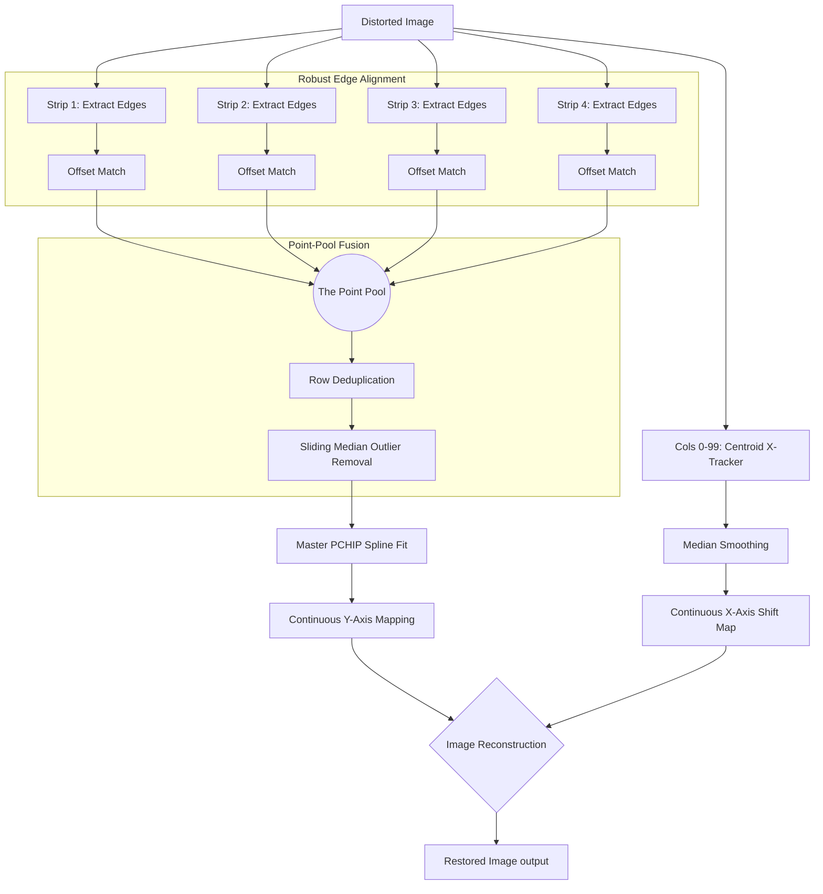

# 4-Strip Staggered Binary (4SSB) Reconstruction Algorithm

The **4-Strip Staggered Binary (4SSB)** algorithm is a highly robust, high-precision technique for detecting and removing mechanical distortions (vibration, slip, and skip) from line-scan imagery. It solves the physical resolution limits of spatial coding formats by interleaving multiple low-frequency binary components.

---

## 1. The Design: Staggered Phase Encoding

In a binary chirp, physical space is encoded via frequency transitions (edges). The problem: if the printing or camera resolution limits you to $N$ cycles (e.g., 25 cycles), a single continuous strip only provides $2N$ (e.g., 50) edges across the entire image. Any distortion hiding "between" two edges goes undetected.

**The 4SSB Solution:** Use 4 identical binary chirps placed side-by-side, but stagger their starting phases:
*   **Strip 1 (Fwd):** Phase $0$
*   **Strip 2 (Rev):** Phase $\pi/4$
*   **Strip 3 (Fwd):** Phase $\pi/2$
*   **Strip 4 (Rev):** Phase $3\pi/4$

This interleaves the transitions. A 25-cycle limit per strip now yields **$4 \times 50 = 200$ perfectly distributed edges** across the scan length, multiplying the effective sampling rate by four without demanding higher physical print/camera resolution.

---

## 2. The "Point-Pool" Fusion Algorithm

To convert the staggered binary strips back into a sub-pixel distortion map (`target_y` vs `distorted_y`), the algorithm employs a **Point-Pool Fusion** strategy instead of averaging independent estimates.

### Algorithm Steps:
1.  **Independent Edge Harvesting:** For each of the 4 strips, extract the distorted sequence of edges (black-to-white and white-to-black transitions).
2.  **Robust Interval Alignment (Sliding Window):** Because mechanical vibration can cause absolute row slips right at the very start of the scan, index 0 of the distorted edges might not map to index 0 of the ideal edges. A sliding-window cross-correlation matches the distorted interval sequences against ideal interval sequences to find the exact starting offset, preventing catastrophic "off-by-one" mapping errors.
3.  **The Point Pool:** Instead of interpolating a continuous curve per strip, we dump every aligned `(distorted_row, ideal_row)` pair from all 4 strips into a single unified "Point Pool".
4.  **Deduplication & RANSAC-lite:** Identical rows are averaged. A sliding median window walks over the sorted pool, violently rejecting any point (edge) that falls significantly outside the local monotonic trend (ignoring noise/smudges that cause false edges).
5.  **Master PCHIP Fit:** A single `PchipInterpolator` (Piecewise Cubic Hermite Interpolating Polynomial) is fitted through the clean, high-density point pool. PCHIP guarantees monotonicity (time cannot flow backward), yielding the final smooth, high-precision vertical motion profile.

---

## 3. Algorithm Flowchart

---

## 4. Why 4SSB is Superior

### Why it beats the 1-Strip Binary approach:
*   **Resolution Ceiling:** A 1-strip binary layout is limited by the optical threshold (MTF) of the camera. Push the frequency too high, and edges blur into gray mush. 
*   **Temporal Blind Spots:** Between any two edges on a 1-strip layout, there is zero data. If the camera slips within that gap, the decoder interpolates blindly. 4SSB populates those blind spots with adjacent staggered edges, ensuring no distortion goes unmeasured.

### Why "Point-Pool" beats 4-Strip Average or Winner-Take-All:

During the R&D process, we attempted three multi-strip synthesis algorithms before discovering the Point-Pool.

1.  **Averaging Independent Splines (Poor):**
    If you extract edges for Strip 1, interpolate a spline for the whole image, do the same for Strip 2, 3, and 4, and then average the 4 splines, the result creates **oscillating artifacts**. Sparse interpolation introduces ringing. Averaging multiple ringing curves just produces a composite ringing curve.
2.  **Winner-Take-All / Confidence Weighting (Sub-optimal for Binary):**
    Winner-Take-All makes sense for analogue/continuous sine-waves where signal amplitude equates to confidence. In binary edge-counting, an edge is an edge. Confidence weighting devolves into selecting a single strip locally, throwing away the $3\times$ sampling density advantage the other staggered strips provide.
3.  **Median of Strips (Lowest Common Denominator):**
    Taking the median of independent splines aggressively destroys sub-pixel nuances, acting as a low-pass filter on the mechanical distortion that we are actively trying to map and correct.

**The "Point-Pool" Breakthrough:**
By acknowledging that *the data is point-cloud data, not continuous data*, we avoid interpolating early. We pool raw physical observations (edges) from all 4 strips into one extremely dense, mathematically pure point-cloud array. We then fit **one single spline** through all 200 points simultaneously. This bounds the interpolation interval so tightly that interpolation-ringing mathematically cannot occur, leading to the **25.14 dB PSNR** gold-standard validation.
