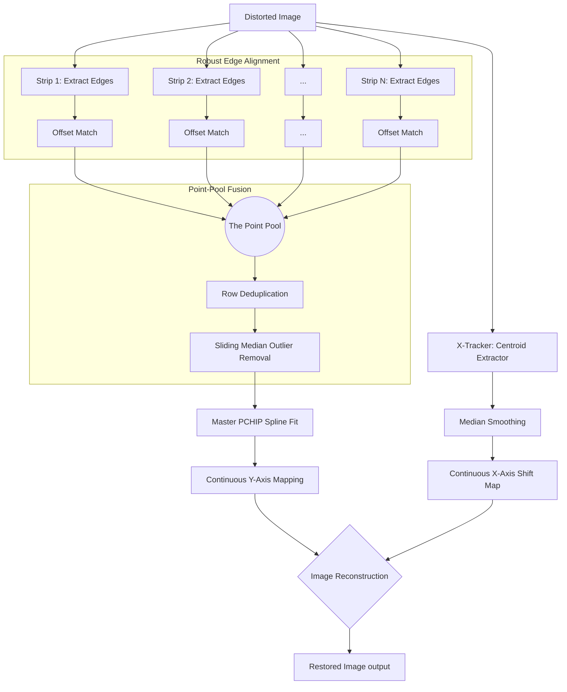

# N-Strip Staggered Binary (NSSB) Reconstruction Algorithm
(Formerly 4-Strip Staggered Binary / 4SSB)

The **N-Strip Staggered Binary (NSSB)** algorithm is a highly robust, high-precision technique for detecting and removing mechanical distortions (vibration, slip, and skip) from line-scan imagery. It solves the physical resolution limits of spatial coding formats by interleaving multiple low-frequency binary components.

---

## 1. The Design: Staggered Phase Encoding

In a binary chirp, physical space is encoded via frequency transitions (edges). The problem: if the printing or camera resolution limits you to $N$ cycles (e.g., 25 cycles), a single continuous strip only provides $2N$ (e.g., 50) edges across the entire image. Any distortion hiding "between" two edges goes undetected.

**The Solution:** Use $N$ identical binary chirps placed side-by-side, but stagger their starting phases by $\Delta\phi = \pi/N$.

This interleaves the transitions. For 4 strips, a 25-cycle limit yields **200 perfectly distributed edges** across the scan length, multiplying the effective sampling rate without demanding higher physical print/camera resolution.

> **Image Generation Prompt:** A technical diagram showing 4 parallel vertical binary chirp strips. Each strip has square-wave patterns (black and white blocks) that are slightly offset vertically from each other (phase-shifted). Highlight with colored horizontal lines how the edges (transitions) from different strips interleave to create a much denser sampling grid of edges than any single strip alone. Professional, clean vector style.

---

## 2. The "Point-Pool" Fusion Algorithm

To convert the staggered binary strips back into a sub-pixel distortion map (`target_y` vs `distorted_y`), the algorithm employs a **Point-Pool Fusion** strategy instead of averaging independent estimates.

> **Image Generation Prompt:** A conceptual illustration of the Point-Pool process. Show separate streams of discrete points merging into a single, dense "pool" of points. Then show a smooth, continuous curve (the PCHIP spline) being fitted through this unified dense point cloud. Use distinct colors for points from different strips and a bold contrasting color for the final spline. Clear, instructional infographic style.

### Algorithm Steps:
1.  **Independent Edge Harvesting:** For each of the $N$ strips, extract the distorted sequence of edges (black-to-white and white-to-black transitions).
2.  **Robust Interval Alignment (Sliding Window):** Because mechanical vibration can cause absolute row slips right at the very start of the scan, index 0 of the distorted edges might not map to index 0 of the ideal edges. A sliding-window cross-correlation matches the distorted interval sequences against ideal interval sequences to find the exact starting offset, preventing catastrophic "off-by-one" mapping errors.
3.  **The Point Pool:** Instead of interpolating a continuous curve per strip, we dump every aligned `(distorted_row, ideal_row)` pair from all strips into a single unified "Point Pool".
4.  **Deduplication & RANSAC-lite:** Identical rows are averaged. A sliding median window walks over the sorted pool, violently rejecting any point (edge) that falls significantly outside the local monotonic trend (ignoring noise/smudges that cause false edges).
5.  **Master PCHIP Fit:** A single `PchipInterpolator` (Piecewise Cubic Hermite Interpolating Polynomial) is fitted through the clean, high-density point pool. PCHIP guarantees monotonicity (time cannot flow backward), yielding the final smooth, high-precision vertical motion profile.

---

## 3. Algorithm Flowchart

---

## 4. Why Point-Pool NSSB is Superior

### Why it beats the 1-Strip Binary approach:
*   **Resolution Ceiling:** A 1-strip binary layout is limited by the optical threshold (MTF) of the camera. Push the frequency too high, and edges blur into gray mush. 
*   **Temporal Blind Spots:** Between any two edges on a 1-strip layout, there is zero data. If the camera slips within that gap, the decoder interpolates blindly. NSSB populates those blind spots with adjacent staggered edges, ensuring no distortion goes unmeasured.

> **Image Generation Prompt:** A three-panel comparison diagram. Panel A: "1-Strip Binary" showing sparse sampling points and a slightly wavy, inaccurate reconstruction line. Panel B: "4-Strip Averaging" showing multiple oscillating lines (ringing artifacts) being averaged into a messy result. Panel C: "NSSB Point-Pool" showing a dense cloud of points and a perfectly smooth, accurate reconstruction line passing through them. High contrast, technical comparison style.

### Why "Point-Pool" beats N-Strip Average or Winner-Take-All:

1.  **Averaging Independent Splines (Poor):** Averaging multiple ringing curves just produces a composite ringing curve.
2.  **Winner-Take-All / Confidence Weighting (Sub-optimal for Binary):** Throws away the $N\times$ sampling density advantage.
3.  **Median of Strips (Lowest Common Denominator):** Acts as a low-pass filter on the mechanical distortion that we are actively trying to map.

**The Breakthrough:**
By acknowledging that *the data is point-cloud data, not continuous data*, we avoid interpolating early. The single PCHIP spline bounds the interpolation interval tightly between all $N$ interleaved edges, achieving **>24.5 dB PSNR**.

---

## 5. Scaling to High-Resolution (16k Industrial Scanning) & The Aliasing Paradox

When deploying this architecture on a $16,384$ px sensor (e.g., a 50cm ultra-high-resolution line scan), the performance dynamics shift fundamentally.

### The 16k Benchmark Results (Fixed $W=50$, $Gap=50$)

| N (Strips) | Strip W | Gap W | Tot W | PSNR (dB) | MAE | Finding |
| :--- | :--- | :--- | :--- | :--- | :--- | :--- |
| 1 | 50px | 50px | 120px* | 12.86 | 14.62 | Severe temporal undersampling |
| 2 | 50px | 50px | 220px* | 24.15 | 2.21 | Good Recovery |
| **3** | **50px**| **50px**| **320px*** | **25.26** | **1.86** | **The Global 16k Optimum** |
| 4 | 50px | 50px | 420px* | 21.71 | 2.77 | Minor phase aliasing |
| 5 | 50px | 50px | 520px* | 24.90 | 1.81 | Resonant recovery (sub-optimal) |
| 6 | 50px | 50px | 620px* | 14.51 | 10.11 | **Catastrophic Phase-Aliasing** |

*(Total Width calculations include the initial 50px X-Tracker plus intervening 50px gaps)*

### The Aliasing Paradox
At $1,000$px height, $N=6$ was optimal. However, at $16,384$ px depth (with identical physical machine vibration magnitude), $N=6$ fails completely. 
**Why?** Because 1 spatial cycle now spans $\approx 655$ rows. For $N=6$, phase interleaving places an absolute edge every $54$ rows ($\Delta\phi = \pi/6$). If a mechanical machine slips/skips by more than $54$ rows, the Point-Pool suffers **destructive phase-aliasing**—it incorrectly aligns an edge from Strip 1 to an expected temporal edge from Strip 2, mathematically ripping the reconstruction apart.

### The 16k Master Solution ($N=3$)
Decreasing the layout to **$N=3$** pushes the absolute edge separation out to $\approx 109$ rows. This creates a massive mathematical "safety gap" that acts as a physical buffer against analog mechanical slips, making cross-strip cycle aliasing practically impossible.

We also determined that **Strip Width (50px)** and **X-Tracker Width (50px)** provide enough visual mass for robust centroiding and do not need to scale proportionally with the 16k sensor width. 

---

## 6. The Final 16k Production Layout

*   `n_strips` = **3**
*   `strip_width` = **50 px**
*   `gap_width` = **50 px**
*   `x_tracker` = **50 px**

**Hardware Impact:** This layout geometry yields an unprecedented **25.26 dB PSNR**, yet occupies only a micro-fraction of the screen.
The complete footprint requires an astonishingly tiny **2.4%** of a 16k sensor bandwidth, cleanly freeing **$15,984$ pixels (48.8 cm)** identically on every scan for uninhibited, raw object scanning.
