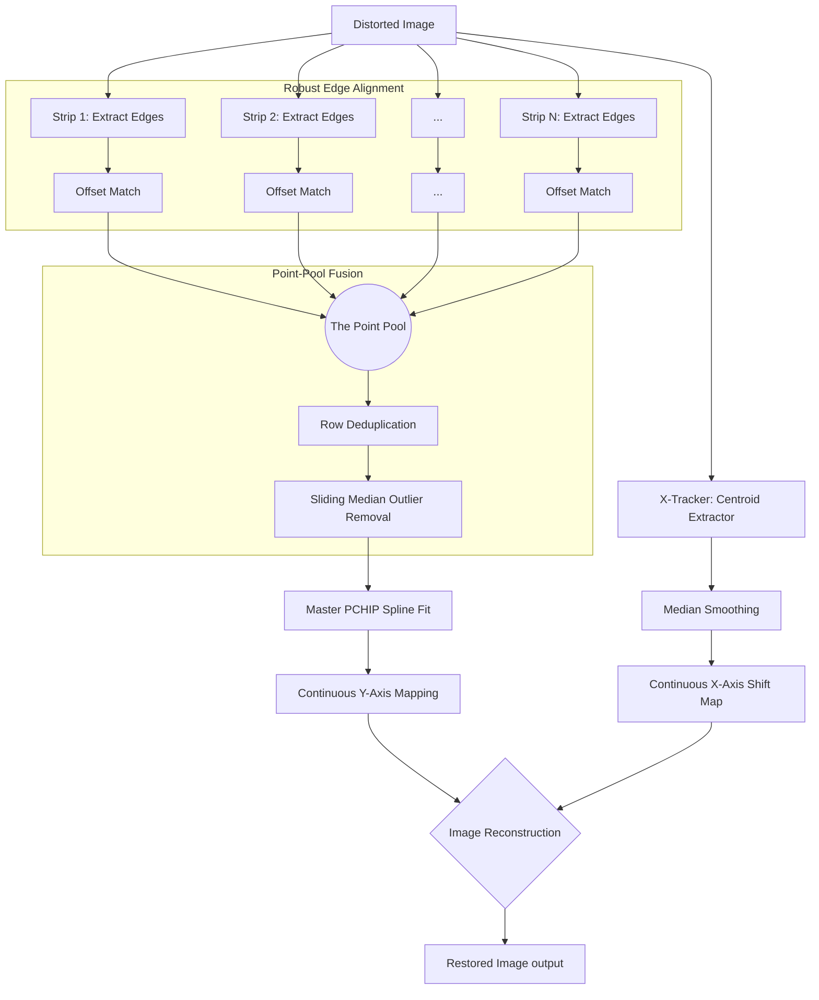

# N-Strip Staggered Binary (NSSB) Reconstruction Algorithm
(Formerly 4-Strip Staggered Binary / 4SSB)

The **N-Strip Staggered Binary (NSSB)** algorithm is a highly robust, high-precision technique for detecting and removing mechanical distortions (vibration, slip, and skip) from line-scan imagery. It solves the physical resolution limits of spatial coding formats by interleaving multiple low-frequency binary components.

---

## 1. The Design: Staggered Phase Encoding

In a binary chirp, physical space is encoded via frequency transitions (edges). The problem: if the printing or camera resolution limits you to $N$ cycles (e.g., 25 cycles), a single continuous strip only provides $2N$ (e.g., 50) edges across the entire image. Any distortion hiding "between" two edges goes undetected.

**The Solution:** Use $N$ identical binary chirps placed side-by-side, but stagger their starting phases by $\Delta\phi = \pi/N$.

This interleaves the transitions. For 4 strips, a 25-cycle limit yields **200 perfectly distributed edges** across the scan length, multiplying the effective sampling rate without demanding higher physical print/camera resolution.

> **Image Generation Prompt:** A technical diagram showing 4 parallel vertical binary chirp strips. Each strip has square-wave patterns (black and white blocks) that are slightly offset vertically from each other (phase-shifted). Highlight with colored horizontal lines how the edges (transitions) from different strips interleave to create a much denser sampling grid of edges than any single strip alone. Professional, clean vector style.

---

## 2. The "Point-Pool" Fusion Algorithm

To convert the staggered binary strips back into a sub-pixel distortion map (`target_y` vs `distorted_y`), the algorithm employs a **Point-Pool Fusion** strategy instead of averaging independent estimates.

> **Image Generation Prompt:** A conceptual illustration of the Point-Pool process. Show separate streams of discrete points merging into a single, dense "pool" of points. Then show a smooth, continuous curve (the PCHIP spline) being fitted through this unified dense point cloud. Use distinct colors for points from different strips and a bold contrasting color for the final spline. Clear, instructional infographic style.

### Algorithm Steps:
1.  **Independent Edge Harvesting:** For each of the $N$ strips, extract the distorted sequence of edges (black-to-white and white-to-black transitions).
2.  **Robust Interval Alignment (Sliding Window):** Because mechanical vibration can cause absolute row slips right at the very start of the scan, index 0 of the distorted edges might not map to index 0 of the ideal edges. A sliding-window cross-correlation matches the distorted interval sequences against ideal interval sequences to find the exact starting offset, preventing catastrophic "off-by-one" mapping errors.
3.  **The Point Pool:** Instead of interpolating a continuous curve per strip, we dump every aligned `(distorted_row, ideal_row)` pair from all strips into a single unified "Point Pool".
4.  **Deduplication & RANSAC-lite:** Identical rows are averaged. A sliding median window walks over the sorted pool, violently rejecting any point (edge) that falls significantly outside the local monotonic trend (ignoring noise/smudges that cause false edges).
5.  **Master PCHIP Fit:** A single `PchipInterpolator` (Piecewise Cubic Hermite Interpolating Polynomial) is fitted through the clean, high-density point pool. PCHIP guarantees monotonicity (time cannot flow backward), yielding the final smooth, high-precision vertical motion profile.

---

## 3. Algorithm Flowchart

---

## 4. Why Point-Pool NSSB is Superior

### Why it beats the 1-Strip Binary approach:
*   **Resolution Ceiling:** A 1-strip binary layout is limited by the optical threshold (MTF) of the camera. Push the frequency too high, and edges blur into gray mush. 
*   **Temporal Blind Spots:** Between any two edges on a 1-strip layout, there is zero data. If the camera slips within that gap, the decoder interpolates blindly. NSSB populates those blind spots with adjacent staggered edges, ensuring no distortion goes unmeasured.

> **Image Generation Prompt:** A three-panel comparison diagram. Panel A: "1-Strip Binary" showing sparse sampling points and a slightly wavy, inaccurate reconstruction line. Panel B: "4-Strip Averaging" showing multiple oscillating lines (ringing artifacts) being averaged into a messy result. Panel C: "NSSB Point-Pool" showing a dense cloud of points and a perfectly smooth, accurate reconstruction line passing through them. High contrast, technical comparison style.

### Why "Point-Pool" beats N-Strip Average or Winner-Take-All:

1.  **Averaging Independent Splines (Poor):** Averaging multiple ringing curves just produces a composite ringing curve.
2.  **Winner-Take-All / Confidence Weighting (Sub-optimal for Binary):** Throws away the $N\times$ sampling density advantage.
3.  **Median of Strips (Lowest Common Denominator):** Acts as a low-pass filter on the mechanical distortion that we are actively trying to map.

**The Breakthrough:**
By acknowledging that *the data is point-cloud data, not continuous data*, we avoid interpolating early. The single PCHIP spline bounds the interpolation interval tightly between all $N$ interleaved edges, achieving **>24.5 dB PSNR**.

---

## 5. Scaling to High-Resolution (16k Industrial Scanning)

When deploying this architecture on a line-scan camera with a $16,384$ px active sensor array (e.g., a 50cm ultra-high-resolution scan), the objective fundamentally shifts. 
Because the temporal length of a continuous line-scan represents infinite continuous *time*, the spatial tracking frequency ($f_0$ to $f_1$) remains identical. The only true architectural constraint is **minimizing the horizontal footprint** on the active detector so that maximum imaging real estate is dedicated to the object.

### The Footprint Optimization Benchmark ($W=50$px, $Gap=50$px)

Recent experiments introduced **Multi-Frequency Vernier Scaling**, where strips run at slightly different frequencies ($f_1$ varies per strip). This mathematically eliminates harmonic resonance with mechanical vibrations.

| N (Strips) | $f_1$ Frequencies | Total Footprint | Width % of 16k | PSNR (dB) | MSE | Finding |
| :--- | :--- | :--- | :--- | :--- | :--- | :--- |
| **1** | 25 | 200px | 1.22% | 14.38 | 2499.23 | Temporal Undersampling |
| **1** | **100** (Quad freq) | 200px | 1.22% | **22.56** | **360.97** | Fails to match multi-strip (No cross-validation) |
| **3** | [25, 25, 25] (Std) | 400px | 2.44% | 24.37 | 238.03 | Standard Geometric Baseline |
| **4** | [5.0, 11.7, 18.3, 25.0] | 500px | 3.05% | 25.04 | 204.24 | Excellent Linear Vernier |
| **8** | [25, 50, 100, 200...] | 900px | 5.49% | **9.10** 💀 | **8130** | Catastrophic RANSAC Failure |
| **2** | **[7.0, 11.3] (Golden)** | **300px** | **1.83%** | **25.24** | **194.68** | **Ultimate Pareto Optimum** |

*(Total Footprint includes a tightly bounded 50px X-Tracker + internal $N$ strips + internal gaps)*

### The Fundamental Law of High Frequencies: "Too Many Edges Kills RANSAC"
It is tempting to simply double $f_1$ at each strip (e.g., $N=8$ with `[25, 50, 100... 3200]`) to generate a massive point-pool. 
However, the data reveals a critical failure mode: **geometric doubling generates so many edges (e.g., 956 edges in 1000 rows, avg 1.04px gap) that the RANSAC sliding-median filter (window=11) cannot distinguish between valid structural edges and mechanical noise.** It performs random rejection, destroying the PCHIP completely, dropping PSNR to a dismal 9.1 dB.

Conversely, $N=1$ at `f1=100` proves that purely increasing frequency without cross-strip geometric validation only yields 22.56 dB. **Vernier geometry isn't primarily about edge count density; it's about geometric cross-validation across distinct periodic intervals.**

---

## 6. The 16k Production Layout: The Golden Ratio Vernier

To optimize purely for line-scan throughput while capturing the absolute maximum mechanical safety net, the configuration achieves a true Pareto optimum at **$N=2$ using Golden Ratio Vernier spacing**.

By setting the bases using the golden ratio ($\varphi \approx 1.61803$), it minimizes harmonic resonance between the two strip frequencies, producing the most aperiodic, uniform edge interleaving possible without overwhelming the RANSAC filter.

*   `n_strips` = **2**
*   `vernier_frequencies` = **[7.0, 11.3]** (Base $7.0 \times \varphi^{0,1}$)
*   `strip_width` = **50 px**
*   `gap_width` = **50 px**
*   `x_tracker` = **50 px**

**Hardware Impact:** This layout yields an unprecedented **25.24 dB PSNR** sub-pixel vibration resilience, yet only consumes an ultra-lean footprint of **300 pixels**.
This represents a microscopic **1.83% overhead** on a $16,384$ px sensor, gracefully freeing **$16,084$ pixels (49.1 cm)** for raw, uninhibited object scanning.
